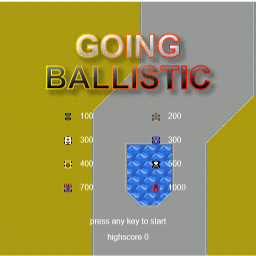
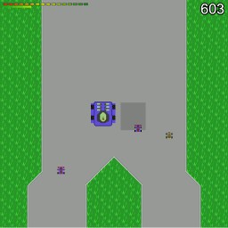
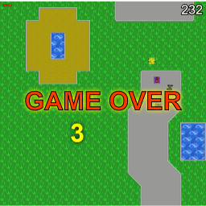

# Going Ballistic
If you're old enough you remember the [Bump and Jump](https://en.wikipedia.org/wiki/Bump_%27n%27_Jump) games from the 80s, like Burning Rubber for the C64. Sneaky me likes to put an easter egg into software releases now and then. Of course into uncritical parts not shipping into production. HTML documentation is my "favorite victim".
So I used the opportunity to write a fun easter egg to get more acquainted with [TypeScript](https://www.typescriptlang.org/). It can be embedded into some HTML. You're looking at the result of my endeavour. It contains the actual game and an editor for levels, should you feel creative.

You steer your car with the cursors keys (up to accelerate, down to break, left and right to adjust direction). The space key lets the car jump (the longer you press the key, the longer the jump). Jumping on other cars gives extra points, collisions with cars cause damage. Collisions with the landscape are instantly fatal.

If you want to use the editor, press Shift+E in the game. The current level will be shown. Levels are stored as indexed images, so there is a import and export feature, to be used with the clipboard. This is not super-fancy but served my needs. New levels via pull requests are welcome.

**Enjoy!**

## Screenshots

## Building the game

You'll need Typescript - you can install it via `npm install -g typescript`. Make sure the dependencies are resolved by running `npm install`.
Then execute `npm run build` to build the game. Open `src/index.html` in a browser; this gives you access to the game and the editor.

## Comments on the code

You'll notice I did not use a loader for the resources. This is a bit cumbersome to code with, but ultimately the payload for the easter egg is small and self-contained.
